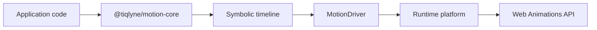

“Framework-agnostic” can sound like a promise to support every rendering system. For Tiqlyne, it means something narrower and more useful: the motion model does not depend on a component framework, and platform execution sits behind an explicit driver contract.

## Why framework-agnostic matters

Applications change over time. A team may migrate a view, introduce a second rendering surface, or reuse its motion language in framework-free code. If animation definitions are expressed entirely through component lifecycle hooks, framework refs, and direct DOM calls, that reuse becomes difficult even when the visual behavior is identical.

Framework independence also improves reasoning. A timeline should be valid or invalid because of its own data—not because a component happened to mount at a particular moment. Separating description from execution lets Tiqlyne test planning, validation, scheduling, inspection, and sampling without booting a UI framework.

This does not mean framework integration is irrelevant. Frameworks still own component lifecycles and references. The application is responsible for passing an appropriate runtime target to the engine at the appropriate time.

## The coupling problem

Animation logic tied directly to a UI component often accumulates several jobs:

- finding elements;
- translating product options into keyframes;
- choosing timings and reduced-motion behavior;
- resolving conflicts with existing animations;
- starting playback and tracking its status.

That component becomes both the authoring model and the runtime adapter. Tests need a browser-like environment, definitions are difficult to catalogue, and another renderer cannot reuse the planning logic. Tiqlyne separates those jobs at the package boundary.

## Core versus driver

The end-to-end flow is deliberately one-way:

The final Web Animations API node describes the official Web runtime in 0.1.0. A different driver could terminate at a different platform API, but no other official production driver currently ships.

## What belongs to motion-core

`@tiqlyne/motion-core` owns concepts that remain meaningful without a browser: motion configs and definitions, typed option schemas, symbolic timelines, compositions, registries, validation, planning, scheduling, diagnostics, playback contracts, inspection, and sampling. It also includes noop and test drivers for non-production use.

The core answers questions such as “Which definition does this type reference?”, “Are these options valid?”, and “When should each step begin?” It does not answer “Which DOM element matches this target?” or “How should these keyframes become browser animations?”

## What belongs to motion-web

`@tiqlyne/motion-web` owns the browser-specific answers. `WebMotionDriver` resolves symbolic targets relative to the root `Element`, converts Tiqlyne keyframes and timing to Web Animations API input, creates animations, applies Web conflict behavior, and exposes a Web playback controller.

The Web driver also receives the current reduced-motion preference as a boolean option. That value is a snapshot supplied by application code; the driver does not call or subscribe to `matchMedia` automatically.

## Why the core does not query the DOM

DOM lookup inside the core would make target resolution a hidden side effect of planning. It would also force every consumer of core types and utilities to provide browser globals, even when validating a timeline in Node.js or sampling it in a test.

Instead, a timeline names its intent and the driver interprets it at execution time. This keeps failures attributable to the right layer: structural timeline issues belong to core validation, while missing browser targets belong to Web resolution and diagnostics.

## Why symbolic targets are useful

Targets such as `self`, `child`, `selector`, and `named` describe relationships rather than storing DOM nodes in a definition. `self` means the root passed to playback. Other target forms let a Web driver resolve descendants, selector matches, or named elements according to the documented rules.

The same definition can therefore build a timeline before any particular element is known. Definitions remain reusable and serializable in spirit, while the application retains control over the actual root target.

## How the boundary improves testing

Core tests can build and validate timelines as plain data. A `TestMotionDriver` can record driver calls without creating browser animations. Web-specific tests can then focus on target lookup, timing conversion, conflicts, controllers, and WAAPI behavior.

The split is not only for test convenience. It prevents platform details from leaking into public definitions and makes diagnostics more precise. It also allows tooling to inspect or sample a timeline without accidentally executing it.

## What future adapters could mean

The generic `MotionDriver<TTarget>` contract provides an extension point for another runtime or an application-specific renderer. A future framework adapter could help connect component lifecycles and targets to the same engine model. Those are architectural possibilities, not available integrations in 0.1.0.

Today, application teams can write a custom driver against the public contract, but they own its runtime semantics and tests. The official production path is `WebMotionDriver` and the Web Animations API.

## Current 0.1.0 limitations

The current release has one official production driver and no official React, Vue, Angular, or Svelte adapter. Symbolic Web target resolution follows the forms documented by the project; it is not a general framework query layer. Platform-specific behavior, including conflict handling and reset semantics, belongs to the Web driver rather than the core.

For exact boundaries, read [Package boundaries](/docs/architecture/package-boundaries). Continue with the [`MotionDriver` contract](/docs/reference/motion-driver), [`WebMotionDriver` behavior](/docs/reference/web-motion-driver), and [motion target forms](/docs/reference/motion-targets).
