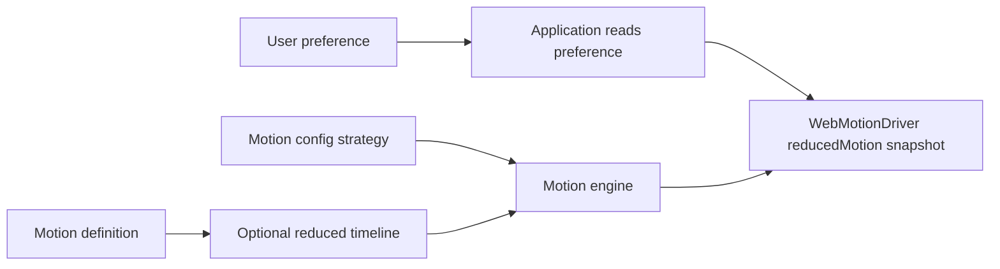

Animation can clarify hierarchy, preserve context, and make state changes easier to follow. It can also cause discomfort or make an interface harder to use. Accessible motion design starts by treating user preference as an input to product behavior—not as a final CSS patch.

## Why reduced motion matters

People may reduce motion because of vestibular disorders, migraines, concentration needs, or simple preference. Large movement, zooming, parallax, and repeated motion can be particularly disruptive. The right response depends on what an animation communicates: some motion can disappear, some should become gentler, and some state feedback still needs to remain visible.

That is why Tiqlyne models reduced motion as policy rather than a single global “off” switch. The application knows the current preference, a motion config chooses a strategy, a definition may provide a meaningful alternative, and the runtime executes the selected timeline.

## `prefers-reduced-motion` at a high level

Browsers expose the operating-system or user-agent preference through the `prefers-reduced-motion` media feature. Application code can read it with `window.matchMedia('(prefers-reduced-motion: reduce)')`.

The value is not a medical diagnosis and does not prescribe one universal design. It is a request to reduce non-essential motion. Product teams still need to decide which transitions are essential to understanding and how to preserve that information with less movement.

## Skip, simplify, or preserve

Tiqlyne 0.1.0 exposes three reduced-motion strategies:

- `skip` does not play the motion when reduced motion applies. Use it for decorative effects whose absence does not hide state.
- `simplify` asks for a calmer alternative. A definition can supply a reduced timeline; otherwise the Web driver can use its documented generic opacity fallback.
- `preserve` plays the original timeline. Reserve it for cases where removing or changing the motion would make the interaction less understandable, and scrutinize whether the original movement is actually necessary.

The strategy is evaluated only when the playback respects reduced motion and the Web driver has received `reducedMotion: true`. Choosing a strategy does not itself discover the user preference.

## How the pieces connect

The arrow ends at a boolean snapshot. `WebMotionDriver` does not watch `matchMedia`; if an application needs live changes, it must listen for them and update its driver or engine wiring.

## How `buildReducedMotionTimeline` helps

A motion definition understands its own visual intent. It is therefore the best place to express a tailored alternative through optional `buildReducedMotionTimeline`. For example, a spatial entrance can become a short opacity transition while retaining the same final state.

The engine builds that alternative when the config strategy is `simplify`, applies defaults, validates it independently, and includes it in the execution plan. When reduced motion applies, the Web driver prefers the supplied timeline. If none exists, the driver can construct its generic opacity-only fallback and emit a diagnostic so the behavior remains observable.

In the 0.1.0 basic pack, `slide-in` provides a definition-specific reduced timeline. `fade-in` and `fade-out` do not provide separate alternatives. That is a concrete current boundary, not a guarantee about future packs.

## Why the driver receives a snapshot

Keeping media-query observation outside the driver makes ownership explicit. Applications already control startup, rendering, and lifecycle teardown; they can choose whether preference changes should rebuild an engine, replace a driver, or flow through another state mechanism.

Automatic observation inside the driver would introduce a hidden global dependency and a subscription lifecycle. It would also be unclear how an existing controller should react midway through playback. Version 0.1.0 avoids inventing that policy: the constructor accepts a boolean and uses that value for playback decisions.

For applications that must react immediately, create a `MediaQueryList`, read its initial `matches`, subscribe to its `change` event, and update the application-level motion service. Ensure the listener is removed during teardown. The exact integration depends on the application architecture and is not supplied as a framework adapter.

## Accessibility practices beyond the API

Reduced-motion support is one part of accessible animation design:

- keep decorative movement optional and restrained;
- preserve the final visual and semantic state when skipping playback;
- do not make animation the only signal for errors, focus, loading, or completion;
- avoid long, looping, or large-scale movement unless it is essential;
- keep controls operable during and after transitions;
- test `skip`, `simplify`, and `preserve` with real content and real interaction flows;
- combine motion testing with keyboard, screen-reader, contrast, and focus testing.

An opacity fallback is not automatically harmless for every person or context. It is a conservative generic option, not a replacement for product-specific accessibility review.

## Common mistakes

The most common mistake is assuming `WebMotionDriver` calls `matchMedia`. It does not. Another is selecting `preserve` globally while describing the result as reduced motion. It preserves the original timeline by design.

Also avoid treating `skip` as permission to leave the interface in its initial hidden state. Playback policy must still lead to usable content. Finally, validate custom reduced timelines just as carefully as main timelines; the engine does so because an accessibility path must not be a second-class execution path.

## Current 0.1.0 limitations

Tiqlyne does not provide automatic live preference synchronization, framework hooks, or user-interface controls for overriding the system preference. The Web driver receives one boolean snapshot. The generic simplification is intentionally limited, and only definitions that implement `buildReducedMotionTimeline` provide a tailored alternative.

For implementation details, use the [reduced-motion guide](/docs/guides/reduced-motion), the [exact policy reference](/docs/reference/reduced-motion), the [`WebMotionDriver` reference](/docs/reference/web-motion-driver), and the [copy-paste example](/docs/examples/reduced-motion).
