# Execution pipeline

The execution pipeline explains how Tiqlyne turns a motion request into a platform playback result.

```mermaid
flowchart LR
  Config[Motion config or timeline] --> Normalize[Normalize options]
  Normalize --> Resolve[Resolve motion definition]
  Resolve --> Build[Build timeline]
  Build --> Defaults[Apply defaults]
  Defaults --> Validate[Validate]
  Validate --> Prepare[Prepare]
  Prepare --> Plan[Create execution plan]
  Plan --> Schedule[Schedule]
  Schedule --> Driver[Driver execution]
  Driver --> Result[Playback result]
```



## 1. Input

The engine can start from three authoring formats.

| Input                    | Engine method                                                     |
| ------------------------ | ----------------------------------------------------------------- |
| Registered motion config | `play`, `plan`, `createPlayback`                                  |
| Direct timeline          | `playTimeline`, `planTimeline`, `createTimelinePlayback`          |
| Composition              | `playComposition`, `planComposition`, `createCompositionPlayback` |

## 2. Motion resolution

When a motion config is used, the engine resolves `type` through the registry.

```ts
await motion.play(element, {
  type: 'fade-in',
  trigger: 'manual'
});
```

If no definition exists for the requested type, playback cannot continue and the result should explain the issue.

## 3. Timeline build

A motion definition builds a `MotionTimelineDefinition`.

Direct timelines skip this step because the timeline is already provided.

Compositions are compiled to timelines before planning and playback.

## 4. Defaults

Defaults can come from multiple levels:

- engine defaults;
- composition defaults;
- timeline defaults;
- track or step options;
- motion-specific defaults.

The most specific value wins.

## 5. Validation

The engine validates timeline structure before execution.

Validation gives useful diagnostics and helps drivers receive predictable timelines.

## 6. Preparation and planning

Preparation resolves timing, labels, positions and step relationships.

The execution plan summarizes what should happen before the driver runs.

```ts
const plan = motion.planTimeline(timeline);

console.log(plan.summary);
```

## 7. Scheduling

Scheduling turns prepared timeline information into absolute timings that a driver can execute.

## 8. Driver execution

A platform driver receives the timeline and executes it.

The official browser driver converts timelines into Web Animations API animations.

## 9. Playback result

Playback returns a result with a status and reason.

Common statuses are:

- `finished`
- `running`
- `paused`
- `cancelled`
- `skipped`
- `failed`

Results can also include diagnostics.
