# Architecture overview

Tiqlyne Motion Engine is built around a simple separation:

```txt
Core describes and plans motion.
Drivers execute motion on a platform.
Packs provide reusable motion definitions.
```

## High-level architecture

```mermaid
flowchart TB
  App[Application] --> Core[@tiqlyne/motion-core]
  Pack[@tiqlyne/motion-pack-basic] --> Core
  Core --> Driver[@tiqlyne/motion-web]
  Driver --> Browser[Browser / Web Animations API]
```

## Core package

`@tiqlyne/motion-core` contains the platform-independent animation model.

It includes:

- engine creation;
- motion registry;
- motion definitions;
- timeline model;
- timeline builder;
- composition API;
- validation;
- planning;
- scheduling;
- diagnostics;
- playback contracts;
- sampler;
- inspector.

The core package must stay independent from the DOM and browser APIs.

## Web package

`@tiqlyne/motion-web` provides the official browser driver.

It translates Tiqlyne timelines into Web Animations API calls.

It is responsible for:

- resolving DOM targets;
- converting keyframes;
- converting timing options;
- handling reduced motion;
- handling animation conflicts;
- creating playback controllers.

## Basic motion pack

`@tiqlyne/motion-pack-basic` provides the official basic animation pack.

The current motions are:

- `fade-in`
- `fade-out`
- `slide-in`

## Execution pipeline

```mermaid
flowchart LR
  A[Motion config] --> B[Normalize config]
  B --> C[Resolve motion definition]
  C --> D[Build timeline]
  D --> E[Validate timeline]
  E --> F[Prepare timeline]
  F --> G[Create execution plan]
  G --> H[Schedule timeline]
  H --> I[Run platform driver]
  I --> J[Return playback result]
```



## Design goal

The main design goal is to keep animation logic reusable, inspectable and testable before it reaches a platform-specific execution layer.