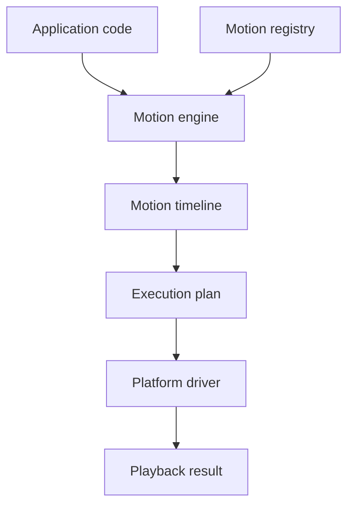

# Core concepts

Tiqlyne Motion Engine is built around a small set of concepts that stay deliberately separated.

The core describes and prepares motion. Drivers execute motion on a platform. Packs provide reusable definitions.



## Motion engine

The motion engine is the main public entry point.

It can:

- register motion definitions;
- play registered motion configs;
- play direct timelines;
- play compositions;
- create playback controllers;
- create execution plans;
- cancel, finish or reset a target through the active driver.

## Motion registry

A motion registry stores reusable motion definitions by type.

```ts
registry.register(myMotionDefinition);
registry.registerMany([motionA, motionB]);
registry.has('slide-in');
registry.get('fade-in');
registry.getAll();
registry.getByCategory('entrance');
```

Use a registry when animations should be reusable, discoverable or configurable from an interface.

## Motion definition

A motion definition is a reusable animation unit.

It receives a build context and returns a timeline. A definition can also define typed options, validation rules and a reduced-motion timeline.

Official basic definitions include:

- `fade-in`
- `fade-out`
- `slide-in`

## Motion config

A motion config tells the engine which registered motion to play.

```ts
await motion.play(element, {
  id: 'card-enter',
  type: 'slide-in',
  trigger: 'manual',
  duration: 300,
  easing: 'ease-out',
  options: {
    direction: 'bottom',
    distance: 24,
    fade: true
  }
});
```

## Timeline

A timeline is the low-level animation structure used by the engine.

It contains:

- timeline defaults;
- labels;
- tracks;
- steps;
- keyframes;
- timing information.

Timelines can be created directly or produced by motion definitions and compositions.

## Track

A track targets something to animate.

Common targets are:

| Target     | Meaning                                                    |
| ---------- | ---------------------------------------------------------- |
| `self`     | The root target passed to the engine.                      |
| `child`    | A child element identified by `data-motion-child`.         |
| `selector` | Elements matching a CSS selector.                          |
| `named`    | A document-level element identified by `data-motion-name`. |

## Step

A step describes one animation segment inside a track.

A step usually contains timing options and keyframes.

```ts
track.step(
  {
    duration: 300,
    easing: 'ease-out'
  },
  (step) => {
    step.from({ opacity: 0 });
    step.to({ opacity: 1 });
  }
);
```

## Composition

A composition is a higher-level authoring model.

It combines registered motions and compiles them into a timeline.

Use compositions when you want to describe a sequence with reusable motion types instead of low-level keyframes.

## Driver

A driver executes a timeline on a platform.

`@tiqlyne/motion-web` provides the official browser driver based on the Web Animations API.

The core package only knows the driver contract. It does not know the DOM or WAAPI.

## Playback controller

A playback controller controls a running animation.

Depending on driver support, it can:

- pause;
- resume;
- cancel;
- finish;
- seek by time;
- seek by progress;
- jump to labels;
- change direction;
- change playback rate;
- emit playback events.

## Diagnostics

Diagnostics explain validation, planning and playback issues.

They are useful for debugging, tests, builder UIs and driver development.

## Sampler

The sampler reads timeline values at a specific time or progress ratio.

Use it for previews, tests, visual tooling and timeline analysis.

## Inspector

The inspector analyzes timeline structure.

Use it to understand tracks, steps, labels, duration and structural metadata.
