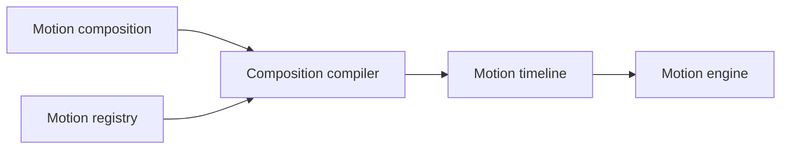

# Compositions

Compositions let you combine registered motions into a larger sequence.

They are an authoring layer that compiles to a timeline.



## Create a composition

```ts
import { createMotionComposition } from '@tiqlyne/motion-core';

const composition = createMotionComposition((composition) => {
  composition.motion('fade-in');

  composition.motion('slide-in', {
    at: 200,
    options: {
      direction: 'bottom',
      distance: 24,
      fade: true
    }
  });
});
```

## Compile a composition

Compositions are compiled with a registry.

```ts
import { compileMotionComposition } from '@tiqlyne/motion-core';

const timeline = compileMotionComposition(composition, {
  registry
});
```

The registry is required because each motion type must be resolved to a registered motion definition.

## Play a composition

You can play a composition directly through the engine.

```ts
await motion.playComposition(element, composition);
```

The engine compiles the composition internally before playing it.

## Plan a composition

You can also create an execution plan without playing it.

```ts
const plan = motion.planComposition(composition);

console.log(plan);
```

## Create a composition playback controller

```ts
const playback = motion.createCompositionPlayback(element, composition);

await playback.pause();
await playback.resume();
await playback.finish();
```

## Composition defaults

```ts
const composition = createMotionComposition((composition) => {
  composition.defaults({
    duration: 300,
    easing: 'ease-out',
    fill: 'both'
  });

  composition.motion('fade-in');

  composition.motion('slide-in', {
    at: 200,
    options: {
      direction: 'bottom',
      distance: 24,
      fade: true
    }
  });
});
```

## Per-motion timing

Each motion in a composition can override timing values.

```ts
const composition = createMotionComposition((composition) => {
  composition.motion('fade-in', {
    defaults: {
      duration: 200
    }
  });

  composition.motion('slide-in', {
    at: 200,
    defaults: {
      duration: 400,
      easing: 'ease-out'
    },
    options: {
      direction: 'bottom',
      distance: 32,
      fade: true
    }
  });
});
```

## Composition vs timeline

Compositions are useful when you want to combine reusable motions.

Timelines are useful when you want to describe low-level animation steps directly.

| Approach    | Best for                              |
| ----------- | ------------------------------------- |
| Composition | Combining registered motions.         |
| Timeline    | Low-level custom animation sequences. |

## When to use compositions

Use compositions when you need to:

- combine several registered motions;
- create reusable animation sequences;
- keep authoring simple;
- compile higher-level definitions into timelines;
- expose animation composition in a future builder UI.
