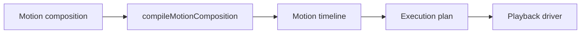

# Compositions

## What you need to know

- Compositions are an **authoring layer** that compiles to a timeline.
- They combine registered motions and direct timelines into a single sequence.
- They require a **registry** to resolve motion types at compile time.
- Item `at` shifts when the item's tracks start in the compiled timeline.
- Item `label` exposes the item's start position as a named timeline label.
- A labelled item **cannot use an anchor-based `at`** in 0.1.0.

Compositions are useful when you want to combine reusable motions.
Timelines are useful when you want to describe low-level animation steps directly.



---

## Create a composition

```ts
import { createMotionComposition } from '@tiqlyne/motion-core';

const composition = createMotionComposition((composition) => {
  composition.motion('fade-in');

  composition.motion('slide-in', {
    at: 200,
    options: {
      direction: 'bottom',
      distance: 24,
      fade: true
    }
  });
});
```

---

## Compile a composition

Compositions are compiled with a registry. The registry resolves each motion type to its registered definition.

```ts
import { compileMotionComposition } from '@tiqlyne/motion-core';

const timeline = compileMotionComposition(composition, {
  registry
});
```

---

## Play a composition

You can play a composition directly through the engine.

```ts
await motion.playComposition(element, composition);
```

The engine compiles the composition internally before playing it.

---

## Plan a composition

```ts
const plan = motion.planComposition(composition);

console.log(plan);
```

---

## Create a composition playback controller

```ts
const playback = motion.createCompositionPlayback(element, composition);

await playback.pause();
await playback.resume();
await playback.finish();
```

---

## Composition defaults

Defaults apply to all items in the composition unless overridden at the item level.

```ts
const composition = createMotionComposition((composition) => {
  composition.defaults({
    duration: 300,
    easing: 'ease-out',
    fill: 'both'
  });

  composition.motion('fade-in');

  composition.motion('slide-in', {
    at: 200,
    options: {
      direction: 'bottom',
      distance: 24,
      fade: true
    }
  });
});
```

---

## Per-item timing

Each item can override defaults individually.

```ts
const composition = createMotionComposition((composition) => {
  composition.motion('fade-in', {
    defaults: {
      duration: 200
    }
  });

  composition.motion('slide-in', {
    at: 200,
    defaults: {
      duration: 400,
      easing: 'ease-out'
    },
    options: {
      direction: 'bottom',
      distance: 32,
      fade: true
    }
  });
});
```

---

## Item `at` — positioning items

`at` shifts the position of all steps produced by that item in the compiled timeline. It uses the same `MotionStepPosition` forms as step `at`:

| Form                  | Example                                   | Meaning                                                                                      |
| --------------------- | ----------------------------------------- | -------------------------------------------------------------------------------------------- |
| `number`              | `at: 200`                                 | Start item steps at 200 ms                                                                   |
| `string`              | `at: 'details'`                           | Start item steps at the named label                                                          |
| `{ label, offset? }`  | `at: { label: 'details', offset: 50 }`    | Label time plus offset                                                                       |
| `{ anchor, offset? }` | `at: { anchor: 'track-end', offset: 50 }` | Anchor applied to compiled steps within their track (unlabelled items only — see note below) |

:::note How anchor-based `at` works on composition items
When an item has an anchor-based `at`, the anchor is applied to each of the item's compiled steps individually within that item's source tracks. Composition items are compiled as separate tracks, even when they use the same target, so anchors never refer to steps from another item.

Use absolute positions (`number`, label, or `{ label, offset? }`) when you want to position items relative to each other. `track-start` and `track-end` can position steps within an item's own tracks. `previous-start` and `previous-end` are invalid whenever they reach the first step of a compiled track, which is normally the case for a registered motion.

A **labelled** item cannot use anchor-based `at` in 0.1.0. See [the limitation below](#limitation-in-010-labelled-items-cannot-use-anchor-based-at).
:::

```ts
const composition = createMotionComposition((composition) => {
  composition.label('content', 200);

  composition.motion('fade-in'); // starts at 0

  composition.motion('slide-in', {
    at: 'content', // starts at 200 ms (the label)
    options: { direction: 'bottom', fade: false }
  });
});
```

---

## Item `label` — exposing positions

When an item has a `label`, the compiler adds that label to the compiled timeline at the item's resolved start position. You can then use `jumpToLabel` on the compiled playback.

```ts
const composition = createMotionComposition((composition) => {
  composition.motion('fade-in', {
    label: 'entrance' // compiled timeline will have label 'entrance' at 0 ms
  });

  composition.motion('slide-in', {
    at: 300,
    label: 'slide' // compiled timeline will have label 'slide' at 300 ms
  });
});

const playback = motion.createCompositionPlayback(element, composition);
await playback.jumpToLabel('slide');
```

### Difference between timeline labels and composition item labels

| Type               | Declared with                             | Purpose                                                                              |
| ------------------ | ----------------------------------------- | ------------------------------------------------------------------------------------ |
| **Timeline label** | `composition.label(name, ms)`             | Absolute named position in the composition, directly included in compiled timeline   |
| **Item label**     | `item.label` in `composition.motion(...)` | Exposes the item's resolved start position as a named label in the compiled timeline |

Both end up as labels on the compiled timeline. The difference is in how their positions are determined.

---

## Limitation in 0.1.0: labelled items cannot use anchor-based `at`

When an item has a `label`, the compiler resolves its position to an absolute millisecond value during compilation. Anchor-based `at` positions (`{ anchor: ... }`) are resolved in a later phase, so the compiler cannot determine the absolute position for a labelled item that uses an anchor.

```ts
// ❌ Invalid in 0.1.0
composition.motion('fade-in', {
  label: 'entrance',
  at: { anchor: 'previous-end' } // throws composition-item-label-anchor-position-unsupported
});

// ✅ Valid — labelled item with absolute at
composition.motion('fade-in', {
  label: 'entrance',
  at: 0
});

// ✅ Valid — unlabelled item, relative to its own compiled track
composition.motion('slide-in', {
  at: { anchor: 'track-start', offset: 50 }
});
```

---

## Nested timeline labels

When a `composition.timeline(...)` item contains a timeline that has its own labels, those labels are **not automatically preserved** in the compiled output. If you need them, declare them explicitly on the composition:

```ts
const innerTimeline = createMotionTimeline((timeline) => {
  timeline.label('inner-point', 150);
  timeline.track('self', (track) => {
    track.step({ duration: 300 }, (step) => {
      step.from({ opacity: 0 });
      step.to({ opacity: 1 });
    });
  });
});

const composition = createMotionComposition((composition) => {
  // Explicitly declare the label if you need it in the compiled timeline
  composition.label('inner-point', 150);

  composition.timeline(innerTimeline);
});
```

---

## Composition vs timeline

| Approach    | Best for                                         |
| ----------- | ------------------------------------------------ |
| Composition | Combining registered motions, reusable sequences |
| Timeline    | Low-level custom animation steps                 |

---

## Common mistakes

- Compiling before the referenced motion types are registered.
- Using duplicate composition item labels (fails with `composition-duplicate-label`).
- Giving a labelled item an anchor-based `at` (fails with `composition-item-label-anchor-position-unsupported`).
- Expecting a composition to preserve nested timeline labels automatically.
- Confusing `composition.label(name, ms)` (absolute timeline label) with item `label` (exposes item start).

---

## Related pages

- [Composition model](../reference/motion-composition.md)
- [Composition builder](../reference/composition-builder.md)
- [Timeline positions and labels](./timeline-positions-and-labels.md)
- [Composition example](../examples/composition.md)
- [Playback controllers](./playback-controllers.md)
