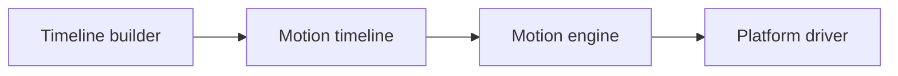

# Direct timelines

Direct timelines let you describe an animation sequence without using a registered motion.

They are useful for custom, one-off or advanced animations.



## Create a timeline

```ts
import { createMotionTimeline } from '@tiqlyne/motion-core';

const timeline = createMotionTimeline((timeline) => {
  timeline.track('self', (track) => {
    track.step(
      {
        duration: 300,
        easing: 'ease-out',
        fill: 'both'
      },
      (step) => {
        step.from({
          opacity: 0
        });

        step.to({
          opacity: 1
        });
      }
    );
  });
});
```

## Play a timeline

```ts
await motion.playTimeline(element, timeline);
```

## Timeline defaults

Defaults can be defined at the timeline level.

```ts
const timeline = createMotionTimeline((timeline) => {
  timeline.defaults({
    duration: 500,
    easing: 'ease-out',
    fill: 'both'
  });

  timeline.track('self', (track) => {
    track.step({}, (step) => {
      step.from({ opacity: 0 });
      step.to({ opacity: 1 });
    });
  });
});
```

## Multiple steps

A track can contain multiple steps.

```ts
const timeline = createMotionTimeline((timeline) => {
  timeline.defaults({
    duration: 300,
    easing: 'ease-out',
    fill: 'both'
  });

  timeline.track('self', (track) => {
    track.step({}, (step) => {
      step.from({ opacity: 0 });
      step.to({ opacity: 1 });
    });

    track.step(
      {
        at: 300
      },
      (step) => {
        step.from({
          transform: {
            y: 16
          }
        });

        step.to({
          transform: {
            y: 0
          }
        });
      }
    );
  });
});
```

## Multiple tracks

A timeline can animate several targets.

```ts
const timeline = createMotionTimeline((timeline) => {
  timeline.track('self', (track) => {
    track.step({}, (step) => {
      step.from({ opacity: 0 });
      step.to({ opacity: 1 });
    });
  });

  timeline.track({ type: 'child', name: 'title' }, (track) => {
    track.step({}, (step) => {
      step.from({
        transform: {
          y: 12
        }
      });

      step.to({
        transform: {
          y: 0
        }
      });
    });
  });
});
```

## Labels

Labels can be used to identify positions in a timeline.

```ts
const timeline = createMotionTimeline((timeline) => {
  timeline.label('enter', 0);
  timeline.label('settled', 500);

  timeline.track('self', (track) => {
    track.step(
      {
        at: 'enter'
      },
      (step) => {
        step.from({ opacity: 0 });
        step.to({ opacity: 1 });
      }
    );
  });
});
```

Playback controllers can jump to labels when supported by the active driver.

```ts
const playback = motion.createTimelinePlayback(element, timeline);

await playback.jumpToLabel('settled');
```

## Transform values

Tiqlyne timelines can describe transform values as structured objects.

```ts
step.from({
  transform: {
    x: -24,
    y: 0,
    scale: 0.95,
    rotate: -4
  }
});

step.to({
  transform: {
    x: 0,
    y: 0,
    scale: 1,
    rotate: 0
  }
});
```

## When to use direct timelines

Use direct timelines when you need:

- precise control;
- multiple tracks;
- custom sequencing;
- labels;
- one-off animations;
- a timeline that does not deserve a reusable motion definition.

## Related pages

- [Timeline model](../reference/motion-timeline.md)
- [Timeline builder](../reference/timeline-builder.md)
- [Multiple tracks and steps](./multiple-tracks-and-steps.md)
- [Direct timeline example](../examples/direct-timeline.md)
