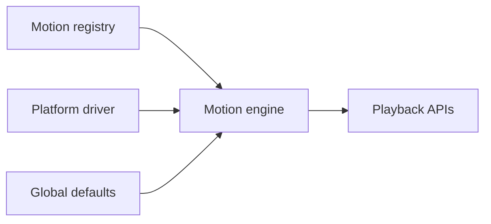

# Engine setup

This guide explains how to create a Tiqlyne Motion Engine instance.

An engine connects four main parts:



## Minimal engine

You can create an engine with the core package and its no-op driver:

```ts
import { createMotionEngine, NoopMotionDriver } from '@tiqlyne/motion-core';

const motion = createMotionEngine({
  driver: new NoopMotionDriver()
});
```

This is useful for planning, validating, inspecting or sampling timelines.

`MotionEngineConfig.driver` is always required. The no-op driver is useful for wiring and deliberately returns skipped results; planning, validation, inspection, and sampling APIs remain available without browser execution.

## Browser engine

For browser playback, use `WebMotionDriver` from `@tiqlyne/motion-web`.

```ts
import { createMotionEngine } from '@tiqlyne/motion-core';
import { WebMotionDriver } from '@tiqlyne/motion-web';

const motion = createMotionEngine<Element>({
  driver: new WebMotionDriver()
});
```

## Engine with registry

A registry stores reusable motion definitions.

```ts
import { createMotionEngine, DefaultMotionRegistry } from '@tiqlyne/motion-core';
import { WebMotionDriver } from '@tiqlyne/motion-web';
import { registerBasicMotions } from '@tiqlyne/motion-pack-basic';

const registry = new DefaultMotionRegistry();

registerBasicMotions(registry);

const motion = createMotionEngine<Element>({
  registry,
  driver: new WebMotionDriver()
});
```

## Engine defaults

Defaults are applied when a motion or timeline does not define its own values.

```ts
const motion = createMotionEngine<Element>({
  registry,
  driver: new WebMotionDriver(),
  defaults: {
    duration: 300,
    easing: 'ease-out',
    fill: 'both'
  }
});
```

Common defaults include:

| Default        | Description                                    |
| -------------- | ---------------------------------------------- |
| `duration`     | Default animation duration in milliseconds.    |
| `delay`        | Default delay before the animation starts.     |
| `easing`       | Default easing function.                       |
| `fill`         | Default fill mode.                             |
| `iterations`   | Default iteration count.                       |
| `playbackRate` | Requested default step speed; driver-specific. |

## Reduced motion

You can connect the engine to the user’s reduced motion preference.

```ts
const prefersReducedMotion = window.matchMedia('(prefers-reduced-motion: reduce)').matches;

const motion = createMotionEngine<Element>({
  driver: new WebMotionDriver({
    reducedMotion: prefersReducedMotion
  })
});
```

Reduced motion behavior is controlled when playing a motion or timeline.

```ts
await motion.play(element, {
  id: 'accessible-enter',
  type: 'slide-in',
  trigger: 'manual',
  respectReducedMotion: true,
  reducedMotionStrategy: 'simplify'
});
```

## Recommended browser setup

```ts
import { createMotionEngine, DefaultMotionRegistry } from '@tiqlyne/motion-core';
import { WebMotionDriver } from '@tiqlyne/motion-web';
import { registerBasicMotions } from '@tiqlyne/motion-pack-basic';

const registry = new DefaultMotionRegistry();

registerBasicMotions(registry);

const motion = createMotionEngine<Element>({
  registry,
  driver: new WebMotionDriver({
    reducedMotion: window.matchMedia('(prefers-reduced-motion: reduce)').matches
  }),
  defaults: {
    duration: 300,
    easing: 'ease-out',
    fill: 'both'
  }
});
```

## Next steps

After creating an engine, you can:

- play registered motions;
- build direct timelines;
- create compositions;
- create playback controllers;
- inspect and sample timelines.
