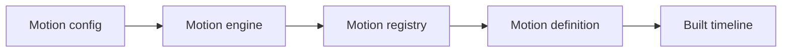

# Registered motions

Registered motions are reusable animation definitions stored in a motion registry.

They allow you to play animations by type instead of manually creating timelines every time.



## Create a registry

```ts
import { DefaultMotionRegistry } from '@tiqlyne/motion-core';

const registry = new DefaultMotionRegistry();
```

## Register the basic pack

```ts
import { registerBasicMotions } from '@tiqlyne/motion-pack-basic';

registerBasicMotions(registry);
```

The basic pack registers:

- `fade-in`
- `fade-out`
- `slide-in`

## Register a custom motion

Register a definition directly when assembling the registry:

```ts
import { RiseInMotion } from '../motions/rise-in.motion';

registry.register(new RiseInMotion());
```

The type must be unique. `DefaultMotionRegistry` throws when the same type is registered twice.

## Register an application pack

Keep a growing application catalogue behind one helper:

```ts
import type { MotionRegistry } from '@tiqlyne/motion-core';
import { RiseInMotion } from './rise-in.motion';

export function registerAppMotions(registry: MotionRegistry): void {
  registry.register(new RiseInMotion());
}
```

Then compose official and application definitions in one startup location:

```ts
const registry = new DefaultMotionRegistry();

registerBasicMotions(registry);
registerAppMotions(registry);
```

`MotionRegistry` registers one definition at a time. If the engine already exists, use `motion.register(...)` or `motion.registerMany(...)` instead.

## Create an engine with a registry

```ts
import { createMotionEngine } from '@tiqlyne/motion-core';
import { WebMotionDriver } from '@tiqlyne/motion-web';

const motion = createMotionEngine<Element>({
  registry,
  driver: new WebMotionDriver()
});
```

## Play a registered motion

```ts
await motion.play(element, {
  id: 'fade-example',
  type: 'fade-in',
  trigger: 'manual'
});
```

## Pass motion options

Each motion can define its own options.

```ts
await motion.play(element, {
  id: 'slide-example',
  type: 'slide-in',
  trigger: 'manual',
  options: {
    direction: 'bottom',
    distance: 32,
    fade: true
  }
});
```

Options are normalized and validated by the matched definition before its timeline reaches the driver.

## Override timing

You can override timing values per motion call.

```ts
await motion.play(element, {
  id: 'slow-fade-example',
  type: 'fade-in',
  trigger: 'manual',
  duration: 500,
  delay: 100,
  easing: 'ease-out'
});
```

## Check if a motion exists

```ts
if (registry.has('slide-in')) {
  await motion.play(element, {
    id: 'conditional-slide-example',
    type: 'slide-in',
    trigger: 'manual'
  });
}
```

## Get a registered definition

```ts
const definition = registry.get('fade-in');

console.log(definition);
```

## List all registered motions

```ts
const definitions = registry.getAll();

console.log(definitions);
```

## Filter by category

```ts
const entranceMotions = registry.getByCategory('entrance');

console.log(entranceMotions);
```

## Why use registered motions?

Registered motions are useful when you want to:

- reuse animation behavior;
- expose animations in a builder UI;
- validate options;
- keep animations consistent;
- separate animation authoring from animation execution;
- create reusable packs.

## Registered motion vs direct timeline

Use a registered motion when the animation is reusable.

Use a direct timeline when the animation is specific to one case.

| Approach          | Best for                            |
| ----------------- | ----------------------------------- |
| Registered motion | Reusable animation behaviors.       |
| Direct timeline   | One-off custom animation sequences. |

## Related pages

- [Create and use a custom motion end to end](../tutorials/custom-motion-end-to-end.md)
- [Custom motion definition guide](./custom-motion-definition.md)
- [Motion registry reference](../reference/motion-registry.md)
- [Motion config](../reference/motion-config.md)
- [Basic motions](./basic-motions.md)
