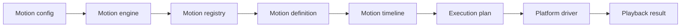

# Tiqlyne Motion Engine

Tiqlyne Motion Engine is a framework-agnostic TypeScript motion engine for defining, composing, validating, inspecting, sampling and controlling animations through a stable core API.

It separates animation logic from platform execution, so the same motion model can be planned and reasoned about independently from the environment that plays it.



## Why Tiqlyne Motion Engine?

Tiqlyne Motion Engine is designed for projects that need animations to be more than isolated UI effects.

It provides:

- a framework-agnostic core;
- a stable timeline model;
- registered reusable motions;
- direct timeline authoring;
- composition support;
- playback controllers;
- diagnostics;
- timeline inspection;
- timeline sampling;
- reduced motion support;
- an official Web Animation API driver;
- an official basic motion pack.

## Official packages

Tiqlyne Motion Engine is split into focused packages:

| Package                      | Description                                                                                        |
| ---------------------------- | -------------------------------------------------------------------------------------------------- |
| `@tiqlyne/motion-core`       | Core engine, timeline model, registry, validation, planning, diagnostics, sampling and inspection. |
| `@tiqlyne/motion-web`        | Web driver based on the Web Animations API.                                                        |
| `@tiqlyne/motion-pack-basic` | Official basic animation pack with ready-to-use motions.                                           |

## Current status

The first public target version is:

```txt
0.1.0
```

This version focuses on a stable, documented foundation for defining, planning and playing animations.
