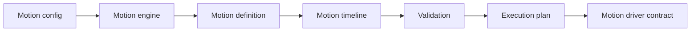

# @tiqlyne/motion-core

`@tiqlyne/motion-core` is the platform-independent core package of Tiqlyne Motion Engine.

It contains the engine contracts, motion definitions, timeline model, registry, validation, planning, diagnostics, playback contracts, sampler and inspector.

It does not depend on the DOM, the Web Animations API, React, Angular, Vue or any browser-specific API.

## Role

The core package is responsible for describing, validating, planning and controlling motion.



## Install

```bash
pnpm add @tiqlyne/motion-core
```

## Main APIs

`@tiqlyne/motion-core` exposes the main building blocks of the engine:

- `createMotionEngine`
- `MotionEngine`
- `DefaultMotionEngine`
- `DefaultMotionRegistry`
- `MotionDefinition`
- `BaseMotionDefinition`
- `SchemaMotionDefinition`
- `createMotionTimeline`
- `createMotionComposition`
- `compileMotionComposition`
- `sampleMotionTimeline`
- `inspectMotionTimeline`
- `MotionDriver`
- playback controller contracts
- diagnostics helpers
- option builders and validators

## Create an engine

```ts
import { createMotionEngine, DefaultMotionRegistry } from '@tiqlyne/motion-core';

const registry = new DefaultMotionRegistry();

const motion = createMotionEngine({
  registry,
  defaults: {
    duration: 300,
    easing: 'ease-out',
    fill: 'both'
  }
});
```

A driver is required when you want to execute animations on a real platform.

For browser playback, use `@tiqlyne/motion-web`.

## Register motions

```ts
import { DefaultMotionRegistry } from '@tiqlyne/motion-core';

const registry = new DefaultMotionRegistry();

registry.register(myMotionDefinition);
```

Once an engine exists, you can register several definitions at once:

```ts
motion.registerMany([motionA, motionB, motionC]);
```

`MotionRegistry` itself exposes only `register` for registration.

## Create a direct timeline

```ts
import { createMotionTimeline } from '@tiqlyne/motion-core';

const timeline = createMotionTimeline((timeline) => {
  timeline.defaults({
    duration: 500,
    easing: 'ease-out',
    fill: 'both'
  });

  timeline.track('self', (track) => {
    track.step({}, (step) => {
      step.from({
        opacity: 0
      });

      step.to({
        opacity: 1
      });
    });
  });
});
```

## Create a composition

```ts
import { createMotionComposition, compileMotionComposition } from '@tiqlyne/motion-core';

const composition = createMotionComposition((composition) => {
  composition.motion('fade-in');
  composition.motion('slide-in', {
    at: 200,
    options: {
      direction: 'bottom',
      distance: 24,
      fade: true
    }
  });
});

const timeline = compileMotionComposition(composition, {
  registry
});
```

## Inspect a timeline

```ts
import { inspectMotionTimeline } from '@tiqlyne/motion-core';

const inspection = inspectMotionTimeline(timeline);

console.log(inspection);
```

## Sample a timeline

```ts
import { sampleMotionTimelineAtTime } from '@tiqlyne/motion-core';

const sample = sampleMotionTimelineAtTime(timeline, 100);

console.log(sample.activeSteps);
```

## What this package does not do

`@tiqlyne/motion-core` does not play animations directly in the browser.

It does not include:

- DOM access;
- Web Animations API calls;
- CSS generation;
- React components;
- Angular directives;
- Vue components;
- GSAP integration.

Platform execution is delegated to drivers such as `@tiqlyne/motion-web`.

## When to use it

Use `@tiqlyne/motion-core` when you need to:

- define reusable animations;
- build timelines;
- compose motions;
- validate motion definitions;
- inspect animation structure;
- sample timelines;
- create custom drivers;
- build framework integrations;
- keep animation logic platform-independent.
