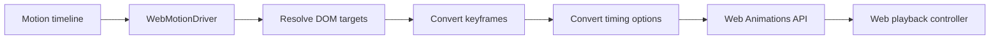

# @tiqlyne/motion-web

`@tiqlyne/motion-web` is the official browser driver for Tiqlyne Motion Engine.

It executes Tiqlyne timelines in the browser using the Web Animations API.

## Role

The Web package connects the platform-independent core model to real DOM elements.



## Install

```bash
pnpm add @tiqlyne/motion-web
```

For a complete browser setup, install it with the core package:

```bash
pnpm add @tiqlyne/motion-core @tiqlyne/motion-web
```

## Basic usage

```ts
import { createMotionEngine } from '@tiqlyne/motion-core';
import { WebMotionDriver } from '@tiqlyne/motion-web';

const motion = createMotionEngine<Element>({
  driver: new WebMotionDriver(),
});
```

## With registered motions

```ts
import { createMotionEngine, DefaultMotionRegistry } from '@tiqlyne/motion-core';
import { WebMotionDriver } from '@tiqlyne/motion-web';
import { registerBasicMotions } from '@tiqlyne/motion-pack-basic';

const registry = new DefaultMotionRegistry();

registerBasicMotions(registry);

const motion = createMotionEngine<Element>({
  registry,
  driver: new WebMotionDriver(),
});

const element = document.querySelector('.card');

if (!element) {
  throw new Error('Target element not found.');
}

await motion.play(element, {
  type: 'fade-in',
  trigger: 'manual',
});
```

## Target resolution

The Web driver can resolve several target types from a timeline:

| Target type | Description |
| --- | --- |
| `self` | Uses the root element passed to the engine. |
| `child` | Looks for a child using `data-motion-child`. |
| `selector` | Uses a CSS selector. |
| `named` | Looks for a document-level element using `data-motion-name`. |

Example:

```html
<div class="card">
  <h2 data-motion-child="title">Title</h2>
  <p data-motion-child="content">Content</p>
</div>
```

```ts
const timeline = createMotionTimeline((timeline) => {
  timeline.track({ type: 'child', name: 'title' }, (track) => {
    track.step({}, (step) => {
      step.from({ opacity: 0 });
      step.to({ opacity: 1 });
    });
  });
});
```

## Reduced motion

`WebMotionDriver` can work with reduced motion preferences.

```ts
const motion = createMotionEngine<Element>({
  driver: new WebMotionDriver({
    reducedMotion: window.matchMedia('(prefers-reduced-motion: reduce)').matches,
  }),
});
```

The engine can then apply a reduced motion strategy such as:

- `skip`
- `simplify`
- `preserve`

## Animation conflicts

The Web driver supports conflict strategies to decide what should happen when an element already has active animations.

Typical strategies are:

- ignore the new animation;
- replace existing animations;
- allow parallel animations.

## Playback controllers

When a timeline is played through `createTimelinePlayback`, the Web driver returns a controller that can control the underlying Web Animations API animations.

```ts
const playback = motion.createTimelinePlayback(element, timeline);

playback.pause();
playback.resume();
playback.setPlaybackRate(1.5);
playback.finish();
```

## What this package does not do

`@tiqlyne/motion-web` does not define the core animation model.

It does not provide:

- the motion registry;
- motion definitions;
- composition authoring;
- timeline sampling;
- timeline inspection;
- framework-specific components.

Those features belong to `@tiqlyne/motion-core`.

## When to use it

Use `@tiqlyne/motion-web` when you want to execute Tiqlyne animations in a browser environment.