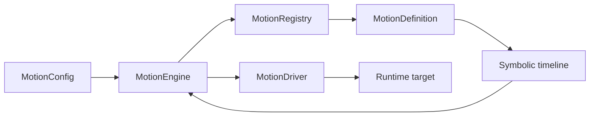

# Motion definition

`MotionDefinition<TOptions>` is the public contract for a reusable, platform-independent motion.

## MotionDefinition\<TOptions\>

```ts
interface MotionDefinition<TOptions extends object = object> {
  readonly type: string;
  readonly label: string;
  readonly description: string;
  readonly category: MotionCategory;
  readonly optionDefinitions: ReadonlyArray<MotionOptionDefinition>;

  getDefaultOptions(): TOptions;
  normalizeOptions(options: Record<string, unknown> | undefined): TOptions;
  validateOptions?(options: TOptions): ReadonlyArray<string>;
  buildTimeline(context: MotionBuildContext<TOptions>): MotionTimelineDefinition;
  buildReducedMotionTimeline?(context: MotionBuildContext<TOptions>): MotionTimelineDefinition;
}
```

| Member                            | Contract                                                            |
| --------------------------------- | ------------------------------------------------------------------- |
| `type`                            | Unique stable type referenced by `MotionConfig.type`.               |
| `label`                           | Human-readable name for tooling.                                    |
| `description`                     | Short human-readable behavior description.                          |
| `category`                        | Category used by registries and tooling.                            |
| `optionDefinitions`               | Public option metadata for builders, tooling, and documentation.    |
| `getDefaultOptions()`             | Returns a complete typed default option object.                     |
| `normalizeOptions(raw)`           | Converts unknown user input into the definition's typed options.    |
| `validateOptions(options)`        | Optionally returns validation messages; an empty array means valid. |
| `buildTimeline(context)`          | Returns the main symbolic timeline.                                 |
| `buildReducedMotionTimeline(...)` | Optionally returns a simplified timeline for reduced-motion policy. |

## MotionBuildContext\<TOptions\>

```ts
type MotionBuildContext<TOptions extends object> = {
  readonly options: TOptions;
  readonly duration: number;
  readonly delay: number;
  readonly easing: MotionEasing;
  readonly trigger: MotionTriggerType;
};
```

`options` is already normalized. `duration`, `delay`, and `easing` are resolved base timing values; `trigger` records what initiated the motion. There is no target or DOM element in this context.

## MotionCategory

The exact category union is:

```ts
type MotionCategory =
  | 'entrance'
  | 'exit'
  | 'attention'
  | 'feedback'
  | 'interaction'
  | 'transition'
  | 'custom';
```

Categories organize definitions; they do not change playback behavior.

## BaseMotionDefinition

`BaseMotionDefinition<TOptions>` is a minimal abstract base. It implements `validateOptions` with an empty result, but subclasses still provide metadata, option definitions, defaults, normalization, and timeline construction. Override validation when the definition has additional rules.

Use it when options are not represented by `defineMotionOptions` or when you need fully custom normalization.

## SchemaMotionDefinition

`SchemaMotionDefinition<TSchema>` connects a `defineMotionOptions` result to the `MotionDefinition` contract. A subclass provides:

- metadata (`type`, `label`, `description`, and `category`);
- protected `options` created by `defineMotionOptions`;
- optional protected `optionValidators`;
- `buildTimeline` and, optionally, `buildReducedMotionTimeline`.

The base class derives `optionDefinitions`, `getDefaultOptions`, and `normalizeOptions` from the schema. Its `validateOptions` runs `optionValidators` after normalization.

```ts
import {
  SchemaMotionDefinition,
  createMotionTimeline,
  defineMotionOptions,
  option,
  type InferMotionOptions,
  type MotionBuildContext
} from '@tiqlyne/motion-core';

const options = defineMotionOptions({
  from: option.range({
    label: 'From opacity',
    defaultValue: 0,
    min: 0,
    max: 1,
    unit: 'none'
  })
});

type Options = InferMotionOptions<typeof options.schema>;

class AppFadeMotion extends SchemaMotionDefinition<typeof options.schema> {
  readonly type = 'app-fade';
  readonly label = 'App fade';
  readonly description = 'Fades application content in.';
  readonly category = 'entrance' as const;
  protected readonly options = options;

  buildTimeline(context: MotionBuildContext<Options>) {
    return createMotionTimeline((timeline) => {
      timeline.track('self', (track) => {
        track.step({ duration: context.duration, easing: context.easing }, (step) => {
          step.from({ opacity: context.options.from });
          step.to({ opacity: 1 });
        });
      });
    });
  }
}
```

## Exact lifecycle

1. A `MotionConfig` references the definition's `type`.
2. The engine normalizes the config.
3. The engine finds that definition in its registry.
4. The definition normalizes its options.
5. The definition validates those normalized options.
6. The definition builds its main timeline.
7. The engine applies defaults and validates the main timeline and, for `simplify`, any definition-provided reduced timeline.
8. The engine creates an execution plan.
9. The driver resolves symbolic targets and plays the timeline.

Validation messages stop planning with reason `invalid-motion-options`. Timeline validation failures use their corresponding planning reason and diagnostics.

## Definition, registry, engine, and driver



Definitions describe and validate data. Registries store definitions. Engines coordinate normalization, planning, and policy. Drivers own runtime target resolution and execution.

## No DOM access

A definition must not query elements, use Web Animations API objects, or depend on a UI framework. Use symbolic targets such as `self` in its timelines. The target passed to `motion.play` is interpreted later by the configured driver.

## Related pages

- [Create and use a custom motion end to end](../tutorials/custom-motion-end-to-end.md)
- [Custom motion definition guide](../guides/custom-motion-definition.md)
- [Motion options](./motion-options.md)
- [Timeline builder](./timeline-builder.md)
- [Motion registry](./motion-registry.md)
