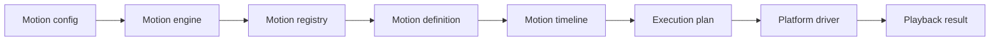

import PackageVersionsTable from '@site/src/components/PackageVersionsTable';

# Tiqlyne Motion Engine

Tiqlyne Motion Engine is a framework-agnostic TypeScript motion engine for defining, composing, validating, inspecting, sampling and controlling animations through a stable core API.

It separates animation logic from platform execution, so the same motion model can be planned and reasoned about independently from the environment that plays it.

## Why Tiqlyne Motion Engine?

Tiqlyne Motion Engine is designed for projects that need animations to be more than isolated UI effects.

It provides:

- a framework-agnostic core;
- a stable timeline model;
- registered reusable motions;
- direct timeline authoring;
- composition support;
- playback controllers;
- diagnostics;
- timeline inspection;
- timeline sampling;
- reduced motion support;
- an official Web Animation API driver;
- an official basic motion pack.

## Official packages

Tiqlyne Motion Engine is split into focused packages:

<PackageVersionsTable />

## Current status

The first public pre-release foundation is available. The packages are versioned independently so each package can evolve at the pace required by its own public API.

## Choose your next step

- New to Tiqlyne? Start with [Installation](./installation.md), then follow [Getting started](./getting-started.md).
- Prefer a guided build? Open [Tutorials](../tutorials/index.md).
- Need working code? Browse [Examples](../examples/index.md).
- Looking for an exact contract? Use the [API Reference](../reference/index.md).
